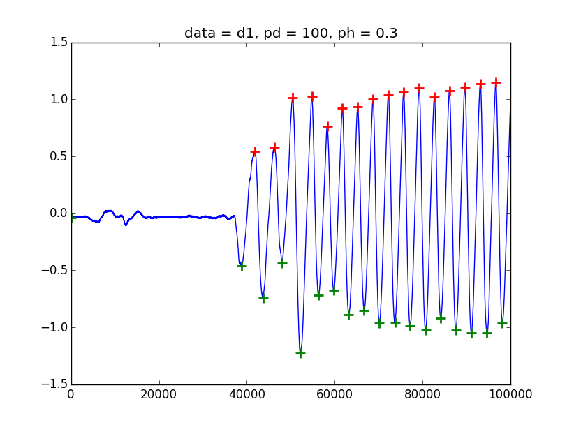
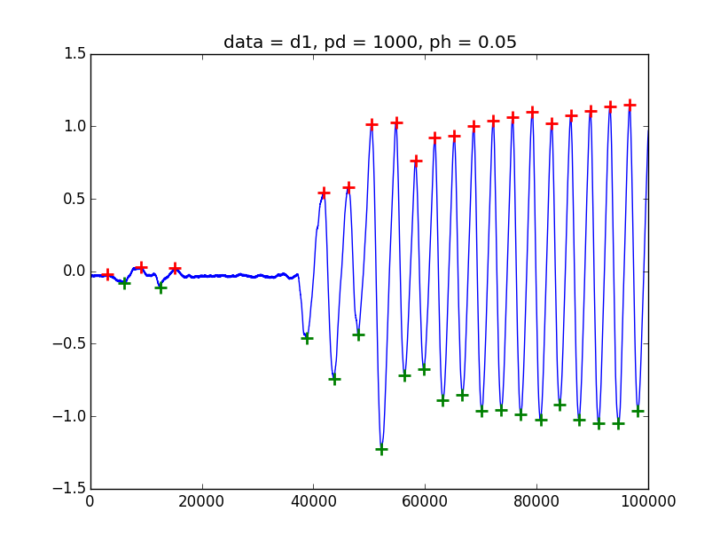
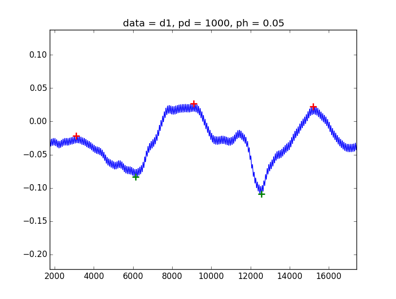
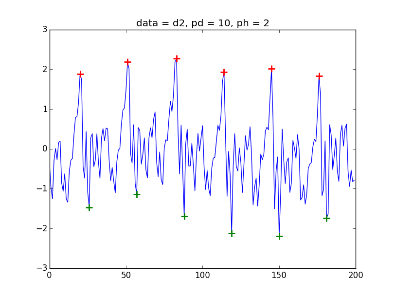
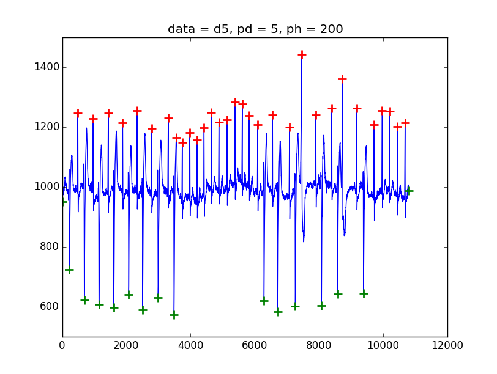
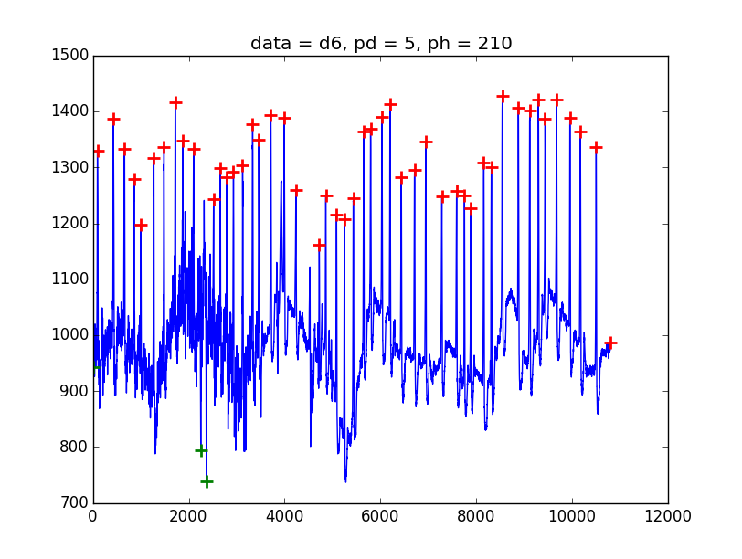

# Peak Detection


[](https://saythanks.io/to/sppmg)

This is a peak detection program base on very simply but effective algorithm, only use maximum and minimum no any signal decomposition or transform, but you can do it by yourself.

The program write by Python3, will port to other language if I have time :D .

## Install and Usage

Read the `README.md` in each language folder.
( Different language may has different function or argument. )

## Example

When you use this program, you should specify two condition :
1. peak distance. (pd)
2. relative height of peak. (ph)

```py
peaks = PeakDetector(d01[1], pd = 100, ph = 0.3)
```

In all images :
* `Blue line` is data curve.
* `Red plus` is local maximum.
* `Green plus` is local minimum.
* `Black triangle_up` is removed max point by filter.
* `Black triangle_down` is removed min point (I don't show black triangles in here).
* `X-axis` is number of data.
* `Y-axis` is value of data.


### Smooth data

First use my data to demo. It's similar harmonic with a small 60 Hz power noise.



It's can easy get small peak in left part.





(It look thick because 60 Hz noise)

### Little sharp data

2nd example use a little sharp wave.
It's an audio signal from MATLAB's mtlb(1001:1200).
MATLAB's findpeaks result in [findpeaks help page](https://www.mathworks.com/help/signal/ref/findpeaks.html#bufhyo1-2).

And my result:



### Very sharp data

3rd and 4th example use a very sharp wave, ECG. These are from the MIT-BIH Arrhythmia Database.



4th is an arrhythmic ECG  It's has nonstationary meaning. (That's why I create this program.)



MATLAB use it to demo [how to use wavelet analyze ECG](https://www.mathworks.com/help/wavelet/ug/r-wave-detection-in-the-ecg.html)


## License

I use MIT license, free and no warranty, please use careful.

If you feel it's nice, save your time. please **share to another 3 guys**.


