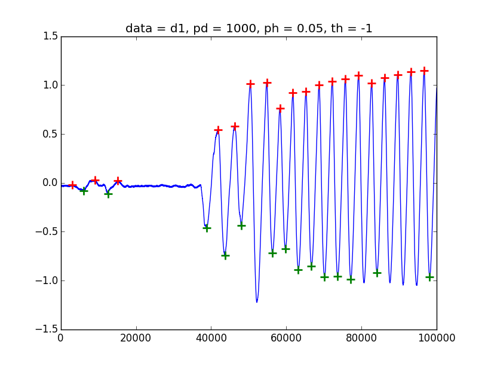
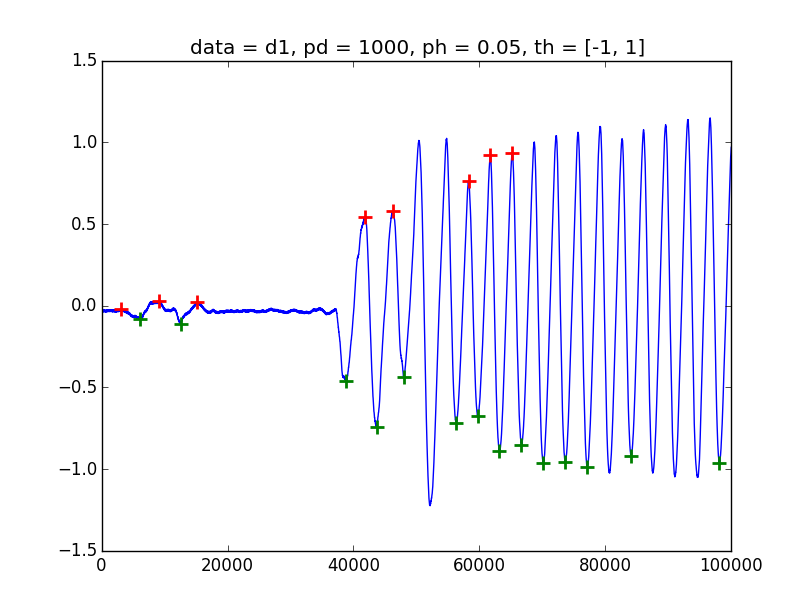
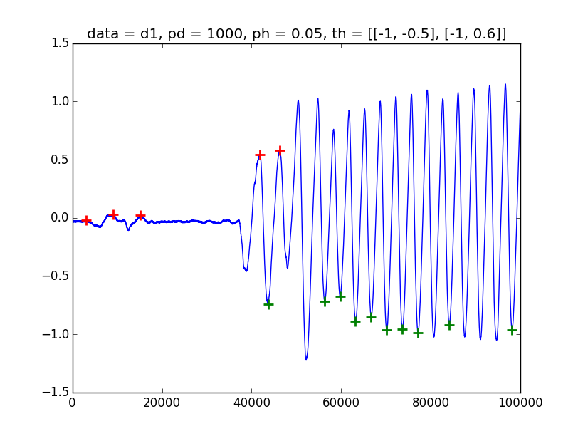

# Peak Detector manual for python

## Requirement

* Python 3 ( Did not test in Python 2)
* numpy

## Install

Save `PeakDetector.py` to your search path of python.

The `PeakDetector_demo.py` just a demo, it will read demo data and plot result.

## Usage

### Example: get index of local maximum

```py
from PeakDetector import PeakDetector           # import PeakDetector
peaks = PeakDetector(data, pd = 100, ph = 0.1)  # get PeakDetector object and analyse
peaks.get('max.i')                              # get index of local maximum
```

Note: Peak will detect after input data immediately, not at `.get()` command.


### PeakDetector argument

```py
peaks = PeakDetector(data, option = value)
```
It will return a object. If you give data, the result will save in it's attributes.

* data
  * It can ignore, so add data later.
  * It must more then 3 elements.
  * It must be a one dimension list or array (It's will convert to numpy.narray).
* option
  * key = value format, see below table.
  * `Distance of peak` : Recommend less then 60% of peak distance or peak width.
    for sharp wave , use small value.
  * `Relative height of peak`: It's difference height of neighboring
    local maximum and local minimum. **It's differed with MATLAB's `MinPeakHeight`** .
  * `Threshold`: It's absolute height of peak, same as MATLAB's `MinPeakHeight`.
    If set a array(or list in python), it's means only in this range can output.
    2D array means separate set range of local maximum and local minimum.
  

| Action                  | Key | Vaild format                       | Example              | Note           |
|-------------------------|-----|------------------------------------|----------------------|----------------|
| Distance of peak        | pd  | all_low                            | pd = 3               | pd > 0        |
| Relative height of peak | ph  | all_low                            | ph = 2               | this style must ph > 0 |
|                         | ph  | [all_low all_up]                   | ph = [-1, 1]         |                |
| Threshold               | th  | all_low                            | th = 3               |                |
|                         | th  | [all_low all_up]                   | th = [-1, 1]         |                |
|                         | th  | [[min_low,min_up],[min_low,min_up]] | th = [[-3,-2],[3,4]] |                |


### Get result (attributes)

Use `.get()` method. For example, below will get local maximum location.
Note, key is string.

```py
peaks.get('max.i')
```

| Vaild key    | Return                                            |
|--------------|---------------------------------------------------|
| 'max.i'      | Index of max with filter.                         |
| 'max.v'      | Value of max with filter.                         |
| 'min.i'      | Index of min with filter.                         |
| 'min.v'      | Value of min with filter.                         |
| 'orig.max.i' | Non-filter (but apply pd) index of original data. |
| 'orig.max.v' | Non-filter (but apply pd) value of original data. |
| 'rm.max.i'   | Filter index of original data for max.            |
| 'rm.max.v'   | Filter value of original data for max.            |
| 'rm.min.i'   | Filter index of original data for min.            |
| 'rm.min.v'   | Filter value of original data for min.            |

### Method list

| Method        | Describe                                                                   |
|---------------|----------------------------------------------------------------------------|
| .get(key)     | Get data. Vaild key list in above table.                                   |
| .update(data) | Update data in PeakDetector object. It's will detect new data immediately. |
| .clear()      | Clear all information in the PeakDetector object.                          |


# Setting suggestion

If you see a clear local maximum but `PeakDetector` can't grab it, try to
decrease `pd`.

# Demo: threshold

## Minimum for max and min



## Range for max and min



## Separate Range for max and min

